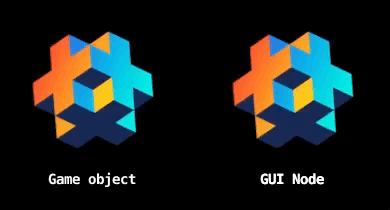

```lua
local act = require("shared.action")
local domain = act.GO_DOMAIN()

function init(self)
  local id = "main:/logo"
	local pulse = act.chain({
		act.scaleTo(id, 1.100, 6/60),
		act.scaleTo(id, 1.025, 10/60),
		act.scaleTo(id, 1.050, 6/60),
		act.scaleTo(id, 1.000, 6/60),
		act.rotateTo(id, 15, 7/60),
		act.rotateTo(id, -15, 14/60),
		act.rotateTo(id, 0, 7/60)
	})
	act.run(domain, act.loop(pulse, act.FOREVER))
end
```
